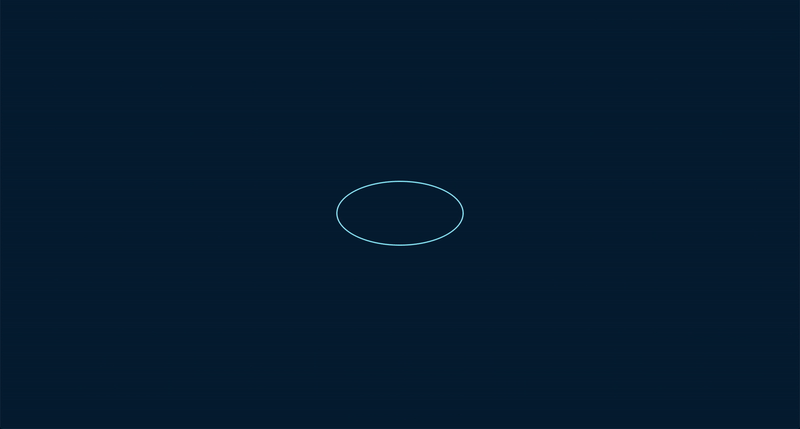
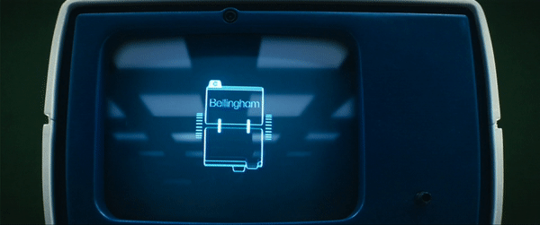

# Lumon Interface

> **"Refinement is clarity. Compliance is contentment."**

Welcome to the **Lumon Interface**, an homage to the enigmatic world of *Severance*. This project replicates the retro-futuristic design of the Lumon workplace with a focus on precision and refinement.

---

## **Demo**

Observe the meticulous design in action:  


Experience the initial system load, reminiscent of the severed floor:  


---

## **Overview**

The **Lumon Interface** is a static web-based simulation inspired by the aesthetics and functionality depicted in the show. It combines minimalist design with dynamic animations to create an immersive experience for all who dare to refine.

### **Design Inspiration**
The user interface pays homage to the iconic set piece from *Severance*, complete with retro-futuristic styling and meticulous detail.  


---

## **Features**

- **Interactive Grid Display**:  
  A mesmerizing grid layout, dynamically populated with data for the ultimate refinement experience.

- **Dynamic Animations**:  
  Each element responds to user interactions, creating a lifelike sense of purpose and compliance.

- **Meticulous Design**:  
  Typography, colors, and layout adhere to the design principles of Lumon Industries—clean, sharp, and compliant.

---

## **Usage**

1. Clone the repository:
   ```bash
   git clone https://github.com/your-username/lumon.git
   cd lumon
   ```

2. Open `index.html` in your preferred browser or serve the project locally:
   ```bash
   # If you have Live Server in VS Code
   Open with Live Server
   ```

3. Enjoy refining data, as every compliant worker should.

---

## **Development Notes**

The current implementation focuses solely on the interface. Features like **Employee Reports** and the **Features Dashboard** are **under development** and will be introduced in future updates.

---

## **Roadmap**

- Add a **Features Dashboard** with links to:
  - Employee Reports
  - Cryptic Message Board
  - Interactive Tasks
- Develop a dynamic **Employee Reports** module.
- Enhance user interactivity with additional animations and sound effects.

---

## **References**

This interface draws inspiration from the *Severance* universe and uses the following resources as references for its design and structure:
- [Severance UI Design](https://www.hudsandguis.com/home/2022/severance)
- Visuals and style inspired by the Apple TV+ series *Severance*.

---

## **Contributions**

Contributions are welcome, but all code must meet Lumon’s exacting standards.  
Please ensure clarity, compliance, and refinement in every pull request.

---

## **License**

The **Lumon Interface** is an independent project inspired by the world of *Severance*. All rights to the show and its intellectual property belong to their respective owners.

---

> **"Your mind must remain pure. The numbers are speaking."**

Happy refining!  
**– The Lumon Interface Development Team**

---

Let me know if you need further refinements or additional sections for this README! 😊
